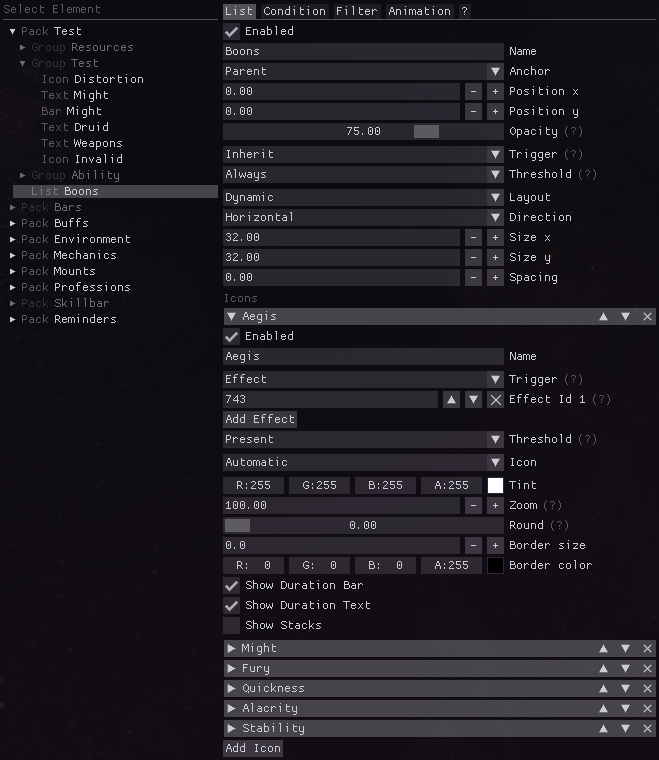

# Reffect
Reffect is a [Guild Wars 2](https://guildwars2.com) addon allowing customizable display of effects, resources, and abilities.

This project is inspired by [WeakAuras](https://github.com/WeakAuras/WeakAuras2) from World of Warcraft and [GW2Clarity](https://github.com/Friendly0Fire/GW2Clarity).
Requires the [Nexus](https://github.com/RaidcoreGG/Nexus) addon manager ([website](https://raidcore.gg/Nexus)). We have channels for discussion and sharing packs on the [Raidcore (Nexus) Discord](https://discord.gg/raidcore).

**WARNING:** Reffect performs memory reading. Use the addon and created displays at your own risk. See [our information policy](#information-policy) below and the [Guild Wars 2 policy on third-party programs](https://help.guildwars2.com/hc/en-us/articles/360013625034-Policy-Third-Party-Programs).

## Features
- Display information as custom icons or text
- Show or hide displays based on current map, profession, specialization, mount etc.
- Ingame editor for display creation & configuration
- Sharing created displays as individual packs
- Effect stacks & durations mimicking ingame behavior
- Ability cooldowns mimicking ingame behavior
- Health, barrier, endurance, defiance, profession resources

## Installation
1. Install the [Nexus](https://github.com/RaidcoreGG/Nexus) addon manager ([website](https://raidcore.gg/Nexus)).
2. Download [`reffect.dll`](../../releases/latest) and place it in your `addons` folder (e.g. `C:\Program Files\Guild Wars 2\addons`).
3. Open the Nexus addon window, click on the refresh button if necessary and load Reffect.
4. *Optional: read the [getting started guide](./docs/getting-started.md) and [documentation on elements](./docs/elements.md).*

## Information Policy
Reffect uses memory reading to access internal information of the Guild Wars 2 game client.
The information is retrieved with the following policy in mind:

1. Information which is expected to be known by the player and does generally **not** change during combat is fine to give at all times. For example the player's current profession & elite specialization, selected traits, equipped weapons or the map they are on.

2. Combat information must be currently conveyed to the player via the game's own graphical user interface. If it is conveyed to the player anyway, we consider it fine to give the same pieces of information in an alternative format. For example their currently visible effects, abilities or health.

3. The alternative display format must limit combination of individual pieces of combat information to a reasonably low logical complexity. We do **not** consider it fine to combine individual pieces of combat information to new information that is much more than the sum of its parts. For example logic combining current might stacks, current quickness and elite ability recharge into a single piece of displayed information is **not** possible.

## Limitations 
- Not available in competitive modes (PvP & WvW).
- Generic effects do not show durations above 5 seconds. *Ingame this information is usually only visible on hover. With 5s left effect icons start to blink, conveying the remaining duration to the player.*
- Screen border & squad highlight effects do not show durations.
- No true stack count for duration stacking effects.
- No information about effects hidden from the player.
- No combining logic for combat information outside of grouping stacks of multiple effects into a single UI element.
- No information about profession resources when hidden from the player.
- No information about ability cooldowns when hidden from the player.

## Building from source
Reffect is *partially* open source: while a major part of the addon is open source, there is a closed source portion which is responsible for memory reading information from the game.

When building from source this closed source portion is substituted with a dummy implementation, disabling all features that require memory reading capabilities.
Contributors can request full builds with memory reading for their pull requests when necessary.
