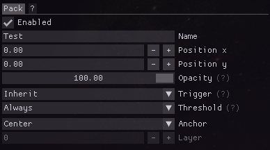
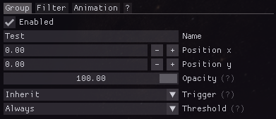
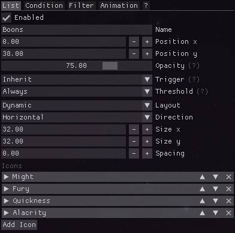

# Element types

All element types share some common functionality, for more information see [shared element options](shared-options.md).

## Pack
Packs are a collection of elements as a single file that can be shared.
Elements can not exist without a pack as parent.
The pack acts as the origin point for all of their children's position on the screen.

## Group
Groups allow applying properties like a position offset, opacity or animation to all of their child elements.
They are also useful use the same filter for a set of elements.

## Icon
Custom icons can displayed, optionally tied to one or multiple effects.
Icons can be loaded from a URL or from a file on your hard drive.
You can find the vast majority of the game's [effect icons on the Guild Wars 2 Wiki](https://wiki.guildwars2.com/wiki/Category:Effect_icons).
They can optionally display the current amount of stacks as well as the duration remaining.

**Note:** File paths within your icons directory will automatically be converted to relative paths to allow easier sharing.
Keep in mind that you will have to share any used icon files alongside the pack file!

## List
Lists are a collection of multiple icons that are automatically aligned according to the chosen layout and direction.
A dynamic layout adjusts to the currently visible icons whereas a static one will keep the gaps of hidden icons.
A list can grow towards several directions, for example upwards, to the right or horizontally centered.

Individual icons in the list have similar configuration options to an icon element.
All icons in a list have to share the same dimensions.

## Text
Custom text can be displayed, optionally tied to one or multiple effects.
This can be used as a fully customizable alternative to the simple stacks/duration  text built into icons.

The following text replacements are supported:
- `%n` for the name of the element as set by the user
- `%i` or `%I` for the current intensity = number of effect stacks, ability ammunition, current resource amount
- `%c` or `%C` for the current progress amount = remaining effect duration, remaining ability recharge, current resource amount
- `%f` or `%F` for the full/maximum progress amount = initial full effect duration, initial ability recharge, maximum resource amount
- `%p` for the current progress in percent = remaining effect duration, remaining ability recharge, current resource amount in percent
- `%%` for a simple % sign

Uppercase text replacements use pretty formatting with units, for example `10.3k` instead of `10287`.

## Bar
Custom progress bars can be based on either the effect intensity or duration.
They are a fully customizable alternative to the simple progress bar built into icons.

