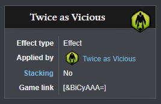
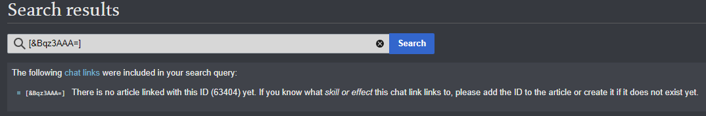
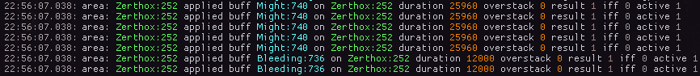
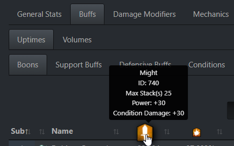

# Getting started
Reffect does not come with any predefined display setups included.
Instead users can create and share their own configurations.

Reffect has channels for discussion and sharing packs on the [Raidcore (Nexus) Discord](https://discord.gg/raidcore).

## Installing existing packs
Shared packs come as `.json` files.
In order to install one, open the editor ingame and click on the `Open folder` button.
Alternatively you can navigate to `Guild Wars 2\addons\reffect` manually.
Simply drop the pack file into the `packs` folder and click `Reload packs`.
Make sure to use `Save changes` first if you have done any unsaved modifications ingame.
Also do not forget to copy any local icon files required by the pack to the `icons` folder.

If you want to learn more about making your own adjustments the pack(s) you just installed, see the [documentation on elements](./elements.md).

## Creating own packs
To start creating your own pack click on the `New pack` button.
You will be prompted with a dialog to decide the file name.
The pack file can not be saved outside the packs folder as it would not be loaded otherwise.
Now you can start adding elements to the pack by right clicking in the elements tree and choosing one of the types of elements listed under `Create`.
This right-click context menu is also where you can move, cut, copy or delete elements and packs.

Now you can start adjusting the elements, connecting them to specific effects or use filters to determine when they should be displayed.
For further information, see the [documentation on elements](./elements.md).

### Finding effect ids
If your use case requires an element to be tied to an effect, you need the skill id of the effect.
This can sometimes be a difficult part about creating new displays.

Chat links for effects contain their id.
For a lot of effects these can be found on the [Guild Wars 2 Wiki](https://wiki.guildwars2.com).
When searching for the effect by name, make sure the page is for **the effect, not the associated ability or trait!**
Hovering over the chat link on the wiki page will show you the id.

To quickly find the page for an effect you see ingame, start typing `/wiki` in your chat, then shift-click the effect and hit enter.
In case there is no page associated with the effect id, the wiki will show you the id.

The wiki also features a way to [search a page by id](https://wiki.guildwars2.com/wiki/Special:RunQuery/Search_by_id) and a [tool to decode chat links](https://wiki.guildwars2.com/wiki/Widget:Chat_link_decoder).

[ArcDPS](https://deltaconnected.com/arcdps/) captures effect applications, which can be seen ingame in Arc's log window.
The log window can be opened by navigating to the `About` tab in Arc's options and clicking the `log` checkbox.
Select `combat area (self)` and make sure `buffapply` is checked.
Beware that the log displays some hidden effects, which are not supported by Reffect!

Log reports generated by [Elite Insights](https://github.com/baaron4/GW2-Elite-Insights-Parser) will show effect ids on hover in multiple locations.
Beware that this may include hidden as well as virtual (negative id) effects!

