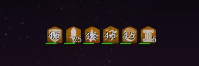

# Getting started
Reffect does not come with any predefined display setups included.
Instead users can create and share their own configurations.

Reffect has channels for discussion and sharing packs on the [Raidcore (Nexus) Discord](https://discord.gg/raidcore).

## Installing existing packs
Shared packs come as `.json` files.
In order to install one, open the editor ingame and click on the `Open folder` button.
Alternatively you can navigate to `Guild Wars 2\addons\reffect` manually.
Simply drop the pack file into the `packs` folder and click `Reload packs`.
Make sure to use `Save changes` first if you have done any unsaved modifications ingame.
Also do not forget to copy any local icon files required by the pack to the `icons` folder.

If you want to learn more about making your own adjustments the pack(s) you just installed, see the [documentation on elements](./elements.md) and [shared element options](./shared-options.md).

## Creating own packs
To start creating your own pack click on the `New pack` button.
You will be prompted with a dialog to decide the file name.
The pack file can not be saved outside the packs folder as it would not be loaded otherwise.
Now you can start adding elements to the pack by right clicking in the elements tree and choosing one of the types of elements listed under `Create`.
This right-click context menu is also where you can move, cut, copy or delete elements and packs.

Now you can start adjusting the elements, connecting them to specific effects or use filters to determine when they should be displayed.
For further information, see the [documentation on elements](./elements.md) and [shared element options](./shared-options.md).

## Finding IDs
If your use case requires an element to be tied to an effect or specific ability (not slot), you need the corresponding **skill ID or chat link**.
Either can be pasted into Reffect's ID input ingame.
Finding the right ID can sometimes be a difficult part about creating new displays.

### Guild Wars 2 Wiki
Chat links for effects & abilities contain their ID.
For a lot of these the ID can be found on the [Guild Wars 2 Wiki](https://wiki.guildwars2.com).
When searching the wiki for an effect/ability by name, make sure you are on the correct page and are **not confusing it with the associated ability, effect or trait!**
Trait chat links will be rejected when pasted into Reffect ingame.
Effect & ability chat links however come from the same skill ID pool, meaning they will be accepted and it can be more difficult to figure out what when wrong.
(Hovering over the chat link on the wiki page will also show you the ID.)

To quickly find the page for an effect/ability you see ingame, start typing `/wiki` in your chat, then shift-click the effect/ability and hit enter.
In case there is no page associated with the ID, the wiki will show you the chat link you pasted as well as the corresponding ID.

The wiki also features a way to [search a page by ID](https://wiki.guildwars2.com/wiki/Special:RunQuery/Search_by_id) and a [tool to decode chat links](https://wiki.guildwars2.com/wiki/Widget:Chat_link_decoder).

### ArcDPS
[ArcDPS](https://deltaconnected.com/arcdps/) captures effect applications, which can be seen ingame in Arc's log window.
The log window can be opened by navigating to the `About` tab in Arc's options and clicking the `log` checkbox.
Select `combat area (self)` and make sure `buffapply` is checked.
Beware that the log displays some hidden effects, which are not supported by Reffect!

### Elite Insights (logs)
Log reports generated by [Elite Insights](https://github.com/baaron4/GW2-Elite-Insights-Parser) will show ability & effect IDs on hover in multiple locations.
Beware that this may include hidden effects as well as virtual (negative) IDs!

The Elite Insights codebase also contains the [largest public collection of known ability & effect IDs](https://github.com/baaron4/GW2-Elite-Insights-Parser/blob/master/GW2EIEvtcParser/ParserHelpers/IDs/SkillIDs.cs).

### Reffect Debug
Reffect itself also features a debug window under "Advanced" in the addon settings.
This window allows you to see current traits, resources and buffs on hover.

