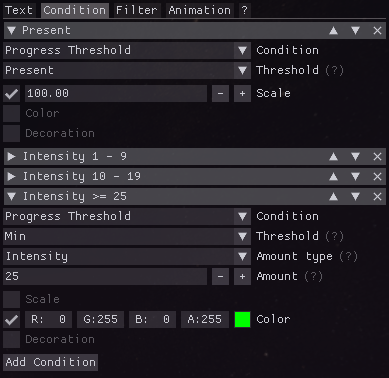
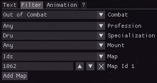
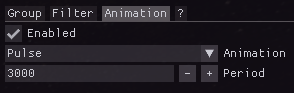

# Shared element options

## Trigger

Triggers are the source of information used by the element.
For more information see the [documentation on triggers](./triggers.md).

## Condition

Conditions allow dynamically changing element properties based on custom thresholds.

## Filter

Filters allow restricting the visibility of elements.
This is especially useful for elements whose triggers are not combat information.
A variety of filters are supported:

- In/out of combat
- Selected elite specialization
- Selected traits
- Selected skills (slot skills, weapon/profession skill replacements)
- Profession-specific selections (Revenant legends, Evoker familiar)
- Equipped weapons
- Equipped sigils & relic
- Current mount
- Current map

Commonly used map IDs can be inserted by right-clicking the "Add Map Id" button.
The trait ID input supports pasting chat links.

## Animation

Optionally an animation can be added to an element to further highlight its presence on screen.

