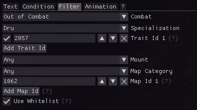

# Shared element options

## Trigger
Triggers are the source of information used by the element.
A variety of sources is supported:
- Your own effects
- Your own abilities by slot or ID
- Your own health, barrier, endurance and profession resources

Triggers can either be inherited from parent elements or set on the element itself.
An additional threshold can be set to determine when the trigger should be considered active.  
For effects, multiple matches are grouped like stacks of an intensity stacking effect.
For abilities, the first match takes priority.
For group elements, the set trigger only gets passed down and has no effect on the visibility of the group itself.

## Condition
Conditions allow dynamically changing element properties based on custom thresholds.

## Filter
Filters allow restricting the visibility of elements.
This is especially useful for elements whose triggers are not combat information.
A variety of filters are supported:
- In/out of combat
- Selected elite specialization
- Selected traits
- Equipped weapons
- Current mount
- Current map

Commonly used map IDs can be inserted by right-clicking the "Add Map Id" button.
The trait ID input supports pasting chat links.

## Animation
Optionally an animation can be added to an element to further highlight its presence on screen.

